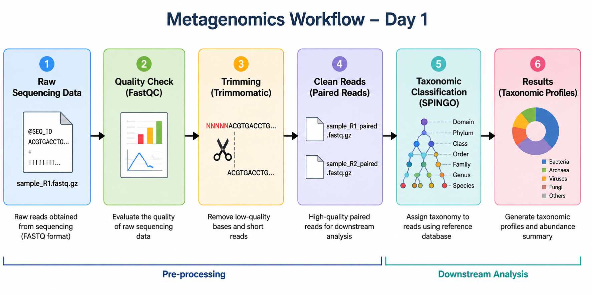
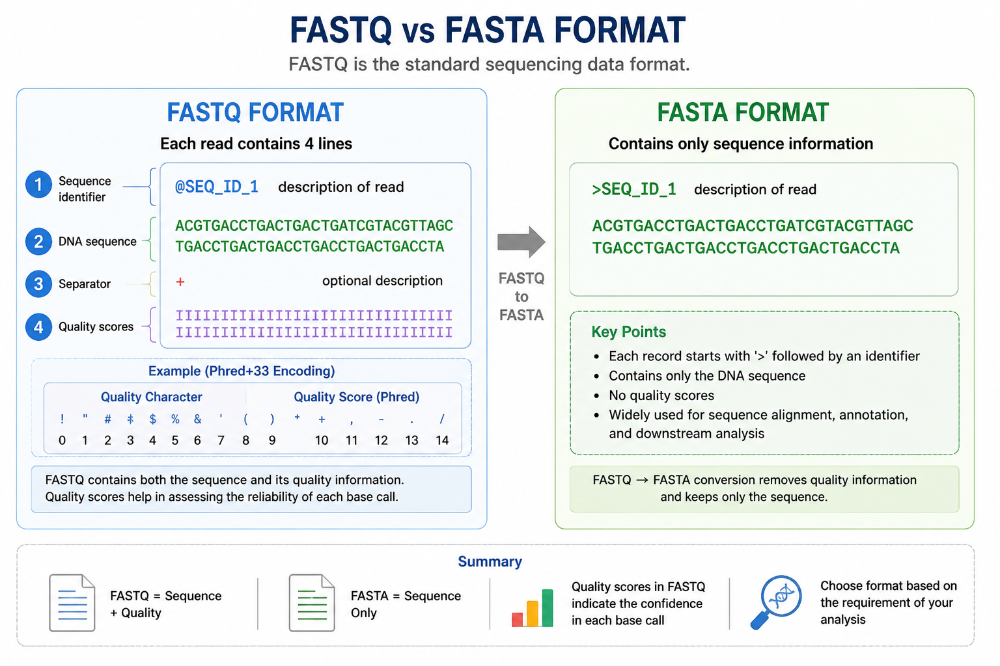
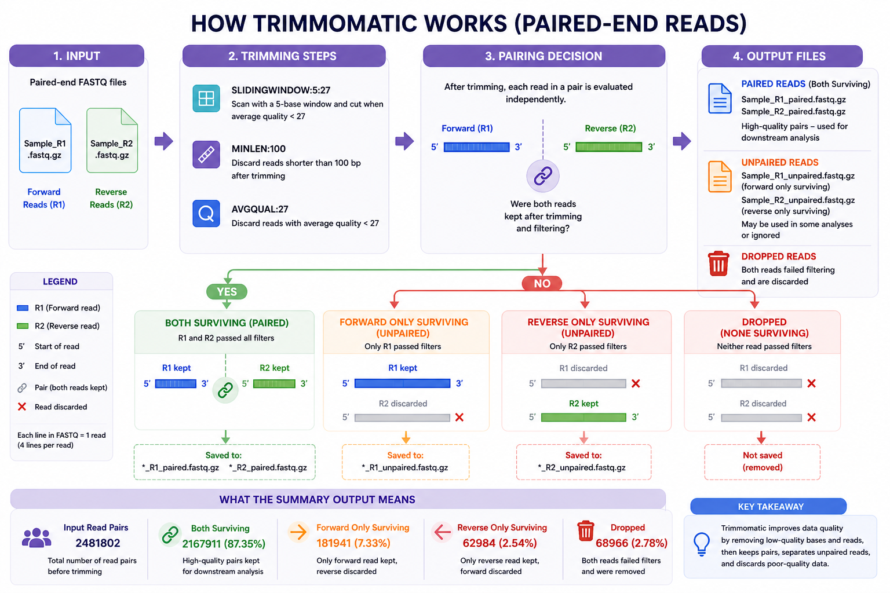

# Day 1 Commands

This practical introduces the basic preprocessing steps in metagenomics analysis, including environment setup, quality control, trimming, and taxonomic classification.

---

## Workflow Overview



Raw FASTQ → Quality Check → Trimming → Clean Reads → Classification

---

## 🔹 STEP 1: Install Miniconda

### Purpose  
Miniconda is used to manage software and dependencies in isolated environments, preventing conflicts between tools.
It is like a locker containing different shells where each shell is an environment.


### Commands
```bash
wget https://repo.anaconda.com/miniconda/Miniconda3-latest-Linux-x86_64.sh

bash Miniconda3-latest-Linux-x86_64.sh

conda --version
```

### Notes  
- Accept license → type `yes`  
- Use default installation path  
- Initialize conda when prompted  

---

## 🔹 STEP 2: Create Environments

### Purpose  
Each tool is installed in a separate environment to avoid dependency conflicts.

### FastQC Environment
```bash
# Create fastqc_env environment
conda create -n fastqc_env -y
# activate the environment
conda activate fastqc_env
# install fastqc in this environment
conda install -c bioconda fastqc -y
# verify the installed fastqc
fastqc --version
```

### Trimmomatic Environment
```bash
# Create trim_env environment
conda create -n trim_env -y
# activate the environment
conda activate trim_env
# install trimmomatic in this environment
conda install -c bioconda trimmomatic -y
# verify the installed trimmomatic
trimmomatic -version
```

---

## 🔹 STEP 3: Understanding FASTQ Format

### Purpose  
FASTQ is the standard sequencing data format.

Each read contains:  
1. Sequence identifier  
2. DNA sequence  
3. Separator (+)  
4. Quality scores  



### View FASTQ Content
```bash
zcat sample_R1_paired.fastq.gz | head -n 8
```

### Convert Formats
```bash
# Fastq.gz to fastq (i.e unzipping)
zcat sample_R1_paired.fastq.gz > sample_R1_paired.fastq
```

```bash
# converting fastq file to fasta file
awk 'NR%4==1 {gsub("@",">",$0); print} NR%4==2 {print}' sample_R1_paired.fastq > sample_R1_paired.fasta
```

---

## 🔹 STEP 4: Quality Check (FastQC)

### Purpose  
Assess sequencing quality before further analysis.

```bash
conda activate fastqc_env
fastqc sample_R1.fastq.gz sample_R2.fastq.gz
```

### Output  
- HTML reports for each file
- A zip file with other details  

### View Reports temporarily via browser
```bash
python3 -m http.server 8000
```

---

## 🔹 STEP 5: Trimming Reads (Trimmomatic)

### Purpose  
Remove low-quality bases and short reads.

```bash
conda activate trim_env

trimmomatic PE \
  -threads 30 \
  -phred33 \
  -trimlog trimlog_sample_R1.log \
  sample_R1.fastq.gz sample_R2.fastq.gz \
  sample_R1_paired.fastq.gz sample_R1_unpaired.fastq.gz \
  sample_R2_paired.fastq.gz sample_R2_unpaired.fastq.gz \
  SLIDINGWINDOW:5:27 \
  MINLEN:100 \
  AVGQUAL:27
```

### Output Files  
Important (Paired Reads):  
- sample_R1_paired.fastq.gz  
- sample_R2_paired.fastq.gz  

Optional (Unpaired Reads):  
- sample_R1_unpaired.fastq.gz  
- sample_R2_unpaired.fastq.gz  


### Count Reads
```bash
zcat sample_R1_paired.fastq.gz | wc -l
```
Divide by 4 to get total reads  

---

## 🔁 Batch Processing 

```bash
for file in *_R1.fastq.gz
do
    base=$(basename $file _R1.fastq.gz)

    echo "Processing $base"

    trimmomatic PE \
      -threads 30 \
      -phred33 \
      -trimlog Trimmomatic_output/trimlog_${base}.log \
      ${base}_R1.fastq.gz ${base}_R2.fastq.gz \
      Trimmomatic_output/${base}_R1_paired.fastq.gz \
      Trimmomatic_output/${base}_R1_unpaired.fastq.gz \
      Trimmomatic_output/${base}_R2_paired.fastq.gz \
      Trimmomatic_output/${base}_R2_unpaired.fastq.gz \
      SLIDINGWINDOW:5:27 \
      MINLEN:100 \
      AVGQUAL:27
done
```

---

## 🔹 STEP 6: Taxonomic Classification (SPINGO)

### Purpose  
Assign taxonomy using a reference database.

### Requirement
# download spingo as a zip file from https://github.com/GuyAllard/SPINGO# and then transfer it to the server, and then unzip it using unzip command
# download the RDP database (16s reference database)

```bash
# Convert fastq.gz to fastq
zcat sample1_R1_paired.fastq.gz sample1_R2_paired.fastq.gz > sample1_paired.fastq
```

```bash
# convert fastq to fasta
awk 'NR%4==1 {gsub("@",">",$0); print} NR%4==2 {print}' sample1_paired.fastq > sample1_paired.fasta
```

```bash
# Run the spingo
/home/omprakash/spingo/SPINGO-master/spingo \
  -d /home/omprakash/spingo/SPINGO-master/database/RDP_11.2.species.fa \
  -p 60 \
  -i sample1_paired.fasta > sample1.spingo.out.txt
```

---

## 🔁 Batch SPINGO

```bash
for f1 in *_R1_paired.fastq.gz; do

    sample=$(basename "$f1" _R1_paired.fastq.gz)
    f2="${sample}_R2_paired.fastq.gz"

    zcat "$f1" "$f2" > "${sample}.fastq"

    awk 'NR%4==1 {gsub("@",">",$0); print} NR%4==2 {print}' "${sample}.fastq" > "${sample}.fasta"

    /home/omprakash/spingo/SPINGO-master/spingo \
        -d /home/omprakash/spingo/SPINGO-master/database/RDP_11.2.species.fa \
        -p 60 \
        -i "${sample}.fasta" > "${sample}.spingo.out.txt"

    echo "Done with $sample."
done
```

---

## 💡 Key Notes
- Perform quality control before trimming  
- Use paired reads for downstream analysis  
- Keep environments separate  
- Automate repetitive tasks  
