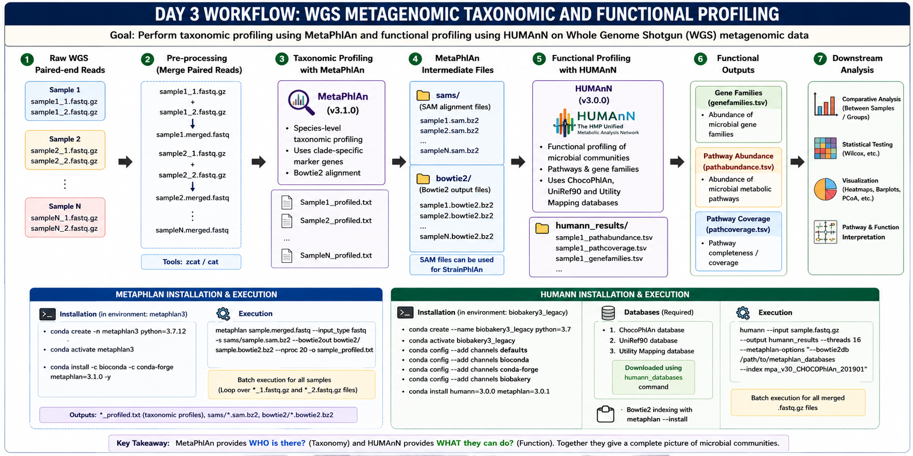

# Day 3 Commands

This practical covers Whole Genome Shotgun (WGS) metagenomics analysis including taxonomic profiling using MetaPhlAn and functional profiling using HUMAnN.

---

## Workflow Overview



Raw WGS Reads → MetaPhlAn Taxonomic Profiling → HUMAnN Functional Profiling → Pathway and Gene Family Analysis

---

# 🔹 STEP 1: Introduction to WGS and Installation of MetaPhlAn (Version 3.1.0)

### Purpose

See the WGS sequence length and depth. Install MetaPhlAn in a separate conda environment for taxonomic profiling of WGS metagenomic datasets.


---

## See the sequence length of WGS reads and compare it with 16s sequencing reads

### See the length of the WGS read

```bash
zcat SRR6468502_2.fastq.gz | awk 'NR==2 || NR==6 {print $0 "\nLength:", length($0), "\n"}'
```

### See the depth of sequencing (Number of total reads)

```bash
zcat SRR6468502_2.fastq.gz | echo $((`wc -l`/4))
```

---

## Installation of MetaPhlAn 3.1.0 in separate environment

### First, create the environment for MetaPhlAn

```bash
conda create -n metaphlan3 python=3.7.12
```

---

### Activate the environment

```bash
conda activate metaphlan3
```

---

### Install MetaPhlAn version 3.1.0

```bash
conda install -c bioconda -c conda-forge metaphlan=3.1.0 -y
```

---

# 🔹 STEP 2: Executing MetaPhlAn on WGS Dataset

### Purpose

Perform species-level taxonomic profiling of WGS metagenomic reads using MetaPhlAn.


---

## Run MetaPhlAn for One Sample

### First create directories for intermediary files

```bash
mkdir -p bowtie2 sams
```

---

### Merge forward and reverse FASTQ files into single FASTQ file

```bash
zcat sample1_1.fastq.gz sample1_2.fastq.gz > sample1.fastq
```

---

### Run MetaPhlAn on the merged FASTQ file

```bash
metaphlan sample1.fastq --input_type fastq -s sams/sample1.sam.bz2 --bowtie2out bowtie2/sample1.bowtie2.bz2 --nproc 20 -o sample1_profiled.txt
```

---

### Remove unnecessary intermediate FASTQ file

### sam file is required further if you wish to run StrainPhlAn

```bash
rm sample1.fastq
```

---

## Batch Run MetaPhlAn on All Samples

```bash
for f1 in *_1.fastq.gz; do

    sample=$(basename "$f1" _1.fastq.gz)
    f2="${sample}_2.fastq.gz"

    zcat "$f1" "$f2" > "${sample}.merged.fastq"

    metaphlan "${sample}.merged.fastq" \
        --input_type fastq \
        -s "sams/${sample}.sam.bz2" \
        --bowtie2out "bowtie2/${sample}.bowtie2.bz2" \
        --nproc 20 \
        -o "${sample}_profiled.txt"

    rm "${sample}.merged.fastq"

done

rm -r bowtie2
```

---

# 🔹 STEP 3: HUMAnN Tool Installation (Version 3.0.0) and Execution

### Purpose

Install HUMAnN for functional profiling of microbial pathways and gene families from WGS metagenomic datasets.


---

## Installing HUMAnN in Separate Environment

### Create new environment

```bash
conda create --name biobakery3_legacy python=3.7 -y
```

---

### Activate the environment

```bash
conda activate biobakery3_legacy
```

---

### Configure channels for installation of the tool

```bash
conda config --add channels defaults
conda config --add channels bioconda
conda config --add channels conda-forge
conda config --add channels biobakery
```

---

### Install HUMAnN version 3.0.0 and MetaPhlAn 3.0.1

```bash
python -m pip install metaphlan==3.0.1 humann==3.0.0
```

---
### To navigate to the working directory

```bash
echo $CONDA_PREFIX
```

## Requirements and Downloading Databases

### Databases Required

1. ChocoPhlAn database  
2. UniRef90  
3. Utility Mapping  

---

### Download ChocoPhlAn database

```bash
humann_databases --download chocophlan full $ENV_DB_PATH/chocophlan --update-config yes
```

---

### Download UniRef90 database

```bash
humann_databases --download uniref uniref90_diamond $ENV_DB_PATH/uniref --update-config yes
```

---

### Download Utility Mapping database

```bash
humann_databases --download utility_mapping full $ENV_DB_PATH/utility_mapping --update-config yes
```

---

### Perform Bowtie2 indexing

```bash
metaphlan --install --bowtie2db $CONDA_PREFIX/lib/python3.7/site-packages/metaphlan/metaphlan_databases --index mpa_v30_CHOCOPhlAn_201901
```

---

### Create target directories in the environment

```bash
ENV_DB_PATH=$CONDA_PREFIX/lib/python3.7/site-packages/humann/data
mkdir -p $ENV_DB_PATH/chocophlan
mkdir -p $ENV_DB_PATH/uniref
mkdir -p $ENV_DB_PATH/utility_mapping
mkdir -p $CONDA_PREFIX/lib/python3.7/site-packages/metaphlan/metaphlan_databases
```

---

### Copy the transferred HUMAnN databases in the environment

```bash
rsync -avP /home/user2/human_database/humann_databases/ $CONDA_PREFIX/lib/python3.7/site-packages/humann/data/
```

---

### Copy the transferred MetaPhlAn databases to the environment

```bash
rsync -avP /home/user2/human_database/metaphlan_databases/ $CONDA_PREFIX/lib/python3.7/site-packages/metaphlan/metaphlan_databases/
```

---

# 🔹 STEP 4: Run HUMAnN on WGS Samples

### Purpose

Perform functional profiling of microbial communities using HUMAnN.


---

## Run HUMAnN on Single Sample

### Merge forward and reverse FASTQ files

```bash
cat SRR6468567_1.fastq.gz SRR6468567_2.fastq.gz > merged_fastq/SRR6468567.fastq.gz

```

---

### Run HUMAnN (only for one sample)

```bash
humann --input merged_fastq/SRR6468567.fastq.gz \
  --output humann_results \
  --threads 36 \
  --nucleotide-database $CONDA_PREFIX/lib/python3.7/site-packages/humann/data/chocophlan/chocophlan \
  --protein-database $CONDA_PREFIX/lib/python3.7/site-packages/humann/data/uniref/uniref \
  --metaphlan-options "--bowtie2db $CONDA_PREFIX/lib/python3.7/site-packages/metaphlan/metaphlan_databases/ --index mpa_v30_CHOCOPhlAn_201901"
```

---

## Batch Run HUMAnN on All Samples

### Loop through and concatenate paired FASTQ files

```bash
for r1 in *_1.fastq.gz; do

    sample=${r1%_1.fastq.gz}
    r2="${sample}_2.fastq.gz"
    
    if [ -f "$r2" ]; then
        echo "Merging $sample..."
        cat "$r1" "$r2" > "merged_fastq/${sample}.fastq.gz"
    else
        echo "Warning: R2 file for $sample not found, skipping..."
    fi
done
```

---


---

### Run HUMAnN on merged files

```bash
conda activate biobakery3_legacy

mkdir -p humann_results

for file in merged_fastq/*.fastq.gz; do
    sample_name=$(basename "$file" .fastq.gz)
    
    humann --input "$file" \
      --output "humann_results/${sample_name}" \
      --threads 36 \
      --nucleotide-database $CONDA_PREFIX/lib/python3.7/site-packages/humann/data/chocophlan/chocophlan \
      --protein-database $CONDA_PREFIX/lib/python3.7/site-packages/humann/data/uniref/uniref \
      --metaphlan-options "--bowtie2db $CONDA_PREFIX/lib/python3.7/site-packages/metaphlan/metaphlan_databases/ --index mpa_v30_CHOCOPhlAn_201901"
done
```

---

# 🔹 STEP 5: Understanding HUMAnN Output Files

### Purpose

Interpret pathway abundance, pathway coverage, and gene family outputs generated by HUMAnN.


---

## Important HUMAnN Output Files

### Gene Families

```text
sample_genefamilies.tsv
```

Contains an abundance of microbial gene families.

---

### Pathway Abundance

```text
sample_pathabundance.tsv
```

Contains abundance of microbial metabolic pathways.

---

### Pathway Coverage

```text
sample_pathcoverage.tsv
```

Contains pathway completeness/coverage information.

---

# 🔹 STEP 6: Data mining and overview of downloading the sequence data

- This section has all manual searching and downloading of data from the database (ENA-EBI) to our server. 

### Transfer the downloaded bash file (ENA) from the laptop to the server
```bash
scp name/of/the/bash/file/from/ENA.sh user1@192.168.17.41:
```

### Now run the bash file on server to download the samples

```bash
nohup bash name/of/the/bash/file/from/ENA.sh > download.log &
```

# 💡 Key Notes

- MetaPhlAn performs taxonomic profiling using species-specific marker genes.
- HUMAnN performs functional profiling using pathway and gene family databases.
- sam files generated from MetaPhlAn are useful for downstream strain-level analysis using StrainPhlAn.
- ChocoPhlAn and UniRef databases are essential for HUMAnN execution.
- Functional profiling helps understand microbial metabolic potential.

```
