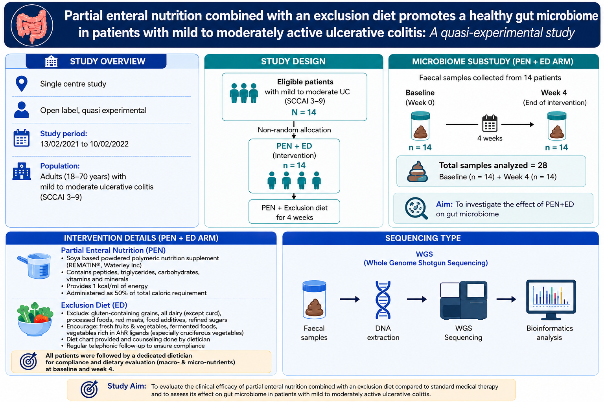

# Day 4 Commands

This practical introduces the strainphlan tool for viewing the strains present in each species, and then further explains the interpretation and analysis of results from the HUMAnN tool from the previous day.

---

## Workflow Overview

Run the strainphlan → Analyze the strains of one species → Interpretation of results from the HUMAnN tool and its analysis → Case Study → Human Microbiome Databases

---
## 🔹 Session 1: Run Strainphlan on the SAM files generated from the Metaphlan and Show Strains of One species


### Extracts clade-specific consensus marker genes from MetaPhlAn alignment files for each sample

```bash
mkdir -p consensus_marker
sample2markers.py -i sams/*.sam.bz2 -o consensus_marker -n 20
```

### Identifies clades/species that have sufficient marker representation across at least 10 samples

```bash
# print everything from the below command in print_clades_only.tsv (species names and also other things)
strainphlan -s consensus_marker/*.pkl -o consensus_marker --print_clades_only --marker_in_n_samples 10 > consensus_marker/print_clades_only.tsv

# extract only species names 
grep -o "s__[^:]*" consensus_marker/print_clades_only.tsv > consensus_marker/clades.txt
```

### Extracts the MetaPhlAn reference marker genes corresponding to one clade/species

```bash
mkdir -p db_marker output

# extract only species names 
extract_markers.py -c clade_name -o db_marker
```

### Performs strain-level phylogenetic reconstruction for the selected clade/species (using sample consensus markers and reference markers)

```bash
strainphlan -s consensus_marker/*.pkl -m db_marker/clade_name.fna -o output -c clade_name --marker_in_n_samples 10 --n 20
```


### Run strainphlan along with Metaphlan in one batch script (Only for your reference)

#### store this script in one bash file (.sh) and then run help option to know how it runs
```bash
#!/bin/bash

# Function to display help
show_help() {
    echo "Usage: $0 <directory> <paired|single> [steps]"
    echo ""
    echo "This script processes a directory with fastq files (paired-end or single-end) through a series of steps:"
    echo "1. Metaphlan (MetaPhlAn 3) for each file or pair of forward and reverse files"
    echo "2. Generate consensus marker."
    echo "3. Print clades for further process"
    echo "4. Extract markers for each clade and run StrainPhlAn (v3)"
    echo ""
    echo "Examples:"
    echo "  Run all steps: bash script.sh /path/to/directory paired 1 2 3 4"
    echo "  Run specific steps: bash script.sh /path/to/directory single 1 3"
    echo ""
    echo "Options:"
    echo "  -h, --help    Show this help message and exit"
}

if [[ "$1" == "-h" || "$1" == "--help" ]]; then
    show_help
    exit 0
fi

if [ $# -lt 3 ]; then
    echo "Usage: $0 <directory> <paired|single> [steps]"
    exit 1
fi

input_dir="$1"
file_type="$2"
shift 2
steps=($@)

cd "$input_dir" || { echo "Error: Unable to access directory $input_dir"; exit 1; }

step1_paired() {
    echo "Running Step 1 (paired-end): MetaPhlAn 3"
    mkdir -p bowtie2 sams
    for file in *_1.fastq.gz; do
        sample_name=$(basename "$file" _1.fastq.gz)
        pigz -p 20 -dc "${sample_name}_1.fastq.gz" "${sample_name}_2.fastq.gz" > "${sample_name}.merged.fastq"
        metaphlan "${sample_name}.merged.fastq" --input_type fastq -s "sams/${sample_name}.sam.bz2" --bowtie2out "bowtie2/${sample_name}.bowtie2.bz2" --nproc 20 -o "${sample_name}_profiled.txt"
        rm "${sample_name}.merged.fastq"
    done
    rm -rf bowtie2
}

step1_single() {
    echo "Running Step 1 (single-end): MetaPhlAn 3"
    mkdir -p bowtie2 sams

    for file in *.fastq.gz; do
        # Skip files ending in _1.fastq.gz or _2.fastq.gz
        if [[ "$file" == *_1.fastq.gz || "$file" == *_2.fastq.gz ]]; then
            continue
        fi

        sample_name=$(basename "$file" .fastq.gz)
       
        metaphlan "$file" --input_type fastq -s "sams/${sample_name}.sam.bz2" --bowtie2out "bowtie2/${sample_name}.bowtie2.bz2" --nproc 20 -o "${sample_name}_profiled.txt"
    done
    rm -rf bowtie2
}


step2() {
    echo "Running Step 2: sample2markers"
    mkdir -p consensus_marker
    sample2markers.py -i sams/*.sam.bz2 -o consensus_marker -n 20
}

step3() {
    echo "Running Step 3: strainphlan --print_clades_only"
    strainphlan -s consensus_marker/*.pkl -o consensus_marker --print_clades_only --marker_in_n_samples 10 > consensus_marker/print_clades_only.tsv

    grep -o "s__[^:]*" consensus_marker/print_clades_only.tsv > consensus_marker/clades.txt
    echo "Saved clades to consensus_marker/clades.txt"
}

step4() {
    echo "Running Step 4: extract_markers and strainphlan"
    clades_file="consensus_marker/clades.txt"
    if [ ! -f "$clades_file" ]; then
        echo "Error: $clades_file not found. Please run step 3 first."
        exit 1
    fi

    mkdir -p db_marker output
    while read -r clade; do
        echo "Processing clade: $clade"
        extract_markers.py -c "$clade" -o db_marker
        strainphlan -s consensus_marker/*.pkl -m "db_marker/${clade}.fna" -o output -c "$clade" --marker_in_n_samples 10 --n 20
    done < "$clades_file"
}

for step in "${steps[@]}"; do
    case $step in
        1)
            [ "$file_type" == "paired" ] && step1_paired || step1_single
            ;;
        2) step2 ;;
        3) step3 ;;
        4) step4 ;;
        *) echo "Invalid step: $step" ;;
    esac
done
```


---

## 🔹 Session 2: HUMAnN Output Processing and Data Transfer

### 1. Join Individual Sample Tables
Create a folder to hold the merged files, then join all gene families, pathway abundance, and pathway coverage files into their respective master matrices.

```bash
mkdir -p combined_tables

# Join all gene families files into one matrix
humann_join_tables -i . -o combined_tables/all_genefamilies.tsv --file_name genefamilies

# Join all pathway abundance files into one matrix
humann_join_tables -i . -o combined_tables/all_pathabundance.tsv --file_name pathabundance

# Join all pathway coverage files into one matrix
humann_join_tables -i . -o combined_tables/all_pathcoverage.tsv --file_name pathcoverage

# 2. Renormalize the Data (to Copies Per Million)

Create a folder for the normalized data, and renormalize the gene families and pathway abundance tables to CPM (Copies Per Million) to allow for fair sample comparisons.

mkdir -p normalized_tables

# Renormalize the gene families table
humann_renorm_table -i combined_tables/all_genefamilies.tsv \
                    -o normalized_tables/all_genefamilies_cpm.tsv \
                    --units cpm --update-snames

# Renormalize the pathway abundance table
humann_renorm_table -i combined_tables/all_pathabundance.tsv \
                    -o normalized_tables/all_pathabundance_cpm.tsv \
                    --units cpm --update-snames

3. Transfer Data to Local Machine

Note: Run these commands on your local personal computer's terminal, not the server.

Open a new terminal on your personal computer, create a folder for your project, and securely copy (scp) the normalized files from the server to your local machine.

# Create a folder for your project locally
mkdir -p ~/Desktop/Metagenomics_Analysis

# Securely copy the normalized tables to your local machine
scp "sagar@192.168.3.254:~/human_outputs/normalized_tables/*.tsv" ~/Desktop/Metagenomics_Analysis/


## 🔹 Data Visualization and Statistical Analysis in R

Once your data is downloaded to your local machine, use the following R scripts to generate plots.

### 1. Data Loading and Cleaning
First, set your working directory and load both the pathway and gene family matrices. We filter out species-specific reads to focus on community-level profiles.

```R
# Set your working directory to where you saved the files

setwd("~/Desktop/Metagenomics_Analysis")

# Read the pathway abundance table (comment.char = "" prevents deleting the header row)

pathway_data <- read.table("all_pathabundance_cpm.tsv", 
                           header = TRUE, sep = "\t", row.names = 1, 
                           comment.char = "", quote = "", check.names = FALSE)

# Read the gene families table

gene_data <- read.table("all_genefamilies_cpm.tsv", 
                        header = TRUE, sep = "\t", row.names = 1, 
                        comment.char = "", quote = "", check.names = FALSE)

# Filter out species-specific rows ("|") and control rows

community_pathways <- pathway_data[!grepl("\\|", rownames(pathway_data)), ]
community_pathways <- community_pathways[!rownames(community_pathways) %in% c("UNMAPPED", "UNINTEGRATED"), ]

community_genes <- gene_data[!grepl("\\|", rownames(gene_data)), ]
community_genes <- community_genes[!rownames(community_genes) %in% c("UNMAPPED", "UNINTEGRATED"), ]


# 2. Principal Component Analysis (PCA)
Visualize the overall metabolic community shifts between timepoints.

library(ggplot2)

# PCA needs samples as rows and pathways as columns, so we transpose (t)

pca_data <- as.data.frame(t(community_pathways))

# Extract timepoints from sample names

timepoints <- ifelse(grepl("0-week", rownames(pca_data)), "0-Week", "52-Week")
pca_data$Timepoint <- timepoints

# Run PCA (excluding the text Timepoint column)

pca_result <- prcomp(pca_data[, -ncol(pca_data)], center = TRUE, scale. = TRUE)

# Extract coordinates for plotting

plot_data <- data.frame(
  Sample = rownames(pca_result$x),
  PC1 = pca_result$x[, 1],
  PC2 = pca_result$x[, 2],
  Timepoint = pca_data$Timepoint
)

pc1_var <- round(summary(pca_result)$importance[2, 1] * 100, 1)
pc2_var <- round(summary(pca_result)$importance[2, 2] * 100, 1)

ggplot(plot_data, aes(x = PC1, y = PC2, color = Timepoint)) +
  geom_point(size = 4, alpha = 0.8) +
  theme_minimal() +
  labs(
    title = "Metabolic Pathway PCA: 0-Week vs 52-Week",
    x = paste0("PC1 (", pc1_var, "%)"),
    y = paste0("PC2 (", pc2_var, "%)")
  ) +
  theme(
    plot.title = element_text(face = "bold", size = 14),
    legend.position = "right"
  )


# 3. Alpha Diversity (Gene Richness)

Calculate the total number of unique genes present in each sample to assess functional richness.

# Calculate total unique genes per sample (value > 0)

gene_richness <- colSums(community_genes > 0)

# Build dataframe for plotting

richness_df <- data.frame(
  Sample = names(gene_richness),
  Richness = gene_richness,
  Timepoint = factor(ifelse(grepl("0-week", names(gene_richness)), "0-Week", "52-Week"), 
                     levels = c("0-Week", "52-Week")) 
)

# Run Wilcoxon test for statistical significance

stat_test <- wilcox.test(Richness ~ Timepoint, data = richness_df)
p_value <- round(stat_test$p.value, 4)

ggplot(richness_df, aes(x = Timepoint, y = Richness, fill = Timepoint)) +
  geom_boxplot(alpha = 0.6, outlier.shape = NA) +
  geom_jitter(width = 0.2, size = 4, alpha = 0.8) +
  theme_minimal() +
  scale_fill_manual(values = c("0-Week" = "#F8766D", "52-Week" = "#00BFC4")) +
  labs(
    title = "Functional Alpha Diversity (Gene Richness)",
    subtitle = paste("Wilcoxon test p-value =", p_value),
    y = "Total Number of Unique Genes",
    x = ""
  ) +
  theme(
    plot.title = element_text(face = "bold", size = 15),
    legend.position = "none",
    axis.text.x = element_text(size = 12, face = "bold")
  )

# 4. Heatmap of Top Variable Pathways

Extract the 30 most variable pathways and plot them as a heatmap.

library(pheatmap)

# Calculate variance and extract top 30

pathway_variance <- apply(community_pathways, 1, var)
top_30_names <- names(sort(pathway_variance, decreasing = TRUE)[1:30])
top_pathways_data <- community_pathways[top_30_names, ]

# Log10 transform to manage skewed biological data (add 1e-5 pseudocount)

heatmap_data <- log10(top_pathways_data + 1e-5)

# Setup color bar annotations

annotation_col <- data.frame(Timepoint = factor(ifelse(grepl("0-week", colnames(heatmap_data)), "0-Week", "52-Week"), 
                                                levels = c("0-Week", "52-Week")))
rownames(annotation_col) <- colnames(heatmap_data)

ann_colors <- list(
  Timepoint = c("0-Week" = "#F8766D", "52-Week" = "#00BFC4")
)

# Draw the heatmap

pheatmap(heatmap_data,
         scale = "row",
         annotation_col = annotation_col,
         annotation_colors = ann_colors,
         show_colnames = TRUE,
         fontsize_row = 7,
         fontsize_col = 8,
         angle_col = 45,
         main = "Top 30 Most Variable Metabolic Pathways",
         color = colorRampPalette(c("navy", "white", "firebrick3"))(50),
         border_color = NA
)

# 5. Volcano Plot (Biomarker Discovery)

Visualize significantly enriched features using ggrepel for clear labeling.

library(ggplot2)
library(ggrepel)

# Add Labels to the Results Table (assumes 'results' df is already calculated)
results$Label <- ifelse(
  results$Significance != "Not Significant", 
  paste0(results$Feature, "\n(p = ", round(results$P_Value, 4), ")"), 
  ""
)

# Plot Volcano Plot with Labels

ggplot(results, aes(x = Log2FoldChange, y = -log10(P_Value), color = Significance)) +
  geom_point(alpha = 0.7, size = 3) +
  geom_text_repel(aes(label = Label), 
                  size = 3.5, 
                  color = "black", 
                  box.padding = 0.8, 
                  show.legend = FALSE) +  
  scale_color_manual(values = c("Enriched in 52-Week" = "#00BFC4", 
                                "Not Significant" = "grey80", 
                                "Enriched in 0-Week" = "#F8766D")) +
  geom_hline(yintercept = -log10(0.05), linetype = "dashed", color = "black", alpha = 0.5) +
  geom_vline(xintercept = c(-1, 1), linetype = "dashed", color = "black", alpha = 0.5) +
  theme_minimal() +
  labs(
    title = "Biomarker Discovery: Volcano Plot",
    subtitle = "Significant pathways labeled with names and p-values",
    x = "Log2 Fold Change (Effect Size)",
    y = "-Log10 P-Value (Statistical Significance)"
  ) +
  theme(
    plot.title = element_text(face = "bold", size = 15),
    legend.title = element_blank(),
    legend.position = "bottom"
  )


---

---
## 🔹 Session 3: Case Study

We will use Whole Genome Sequencing (WGS) data to conduct a hands-on session based on a real case study.


---

