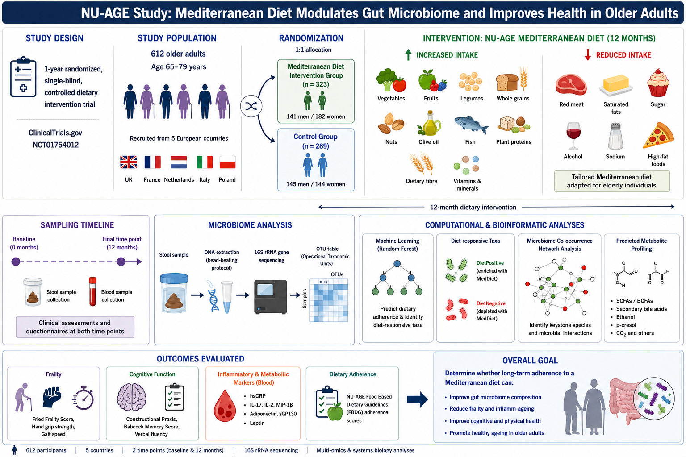

# Day 5 Commands

This practical introduces the workflow for downloading metadata and species profiles from human microbiome databases, followed by a hands-on case study using 16S rRNA sequencing data.

---
## 🔹 Human Microbiome Databases exploration 

1. GMrepo (Data repository for Gut Microbiota): https://gmrepo.humangut.info/home
2. MGnify: https://www.ebi.ac.uk/metagenomics
3. MicrobiomeHD: https://zenodo.org/records/1146764
4. cMD (curated Metagenomic Database): https://waldronlab.io/curatedMetagenomicData/articles/curatedMetagenomicData.html

---
## 🔹 STEP 2: Case Study

- We will use 16S rRNA sequencing data to conduct a hands-on session based on a real case study 
(https://gut.bmj.com/content/69/7/1218)

---

